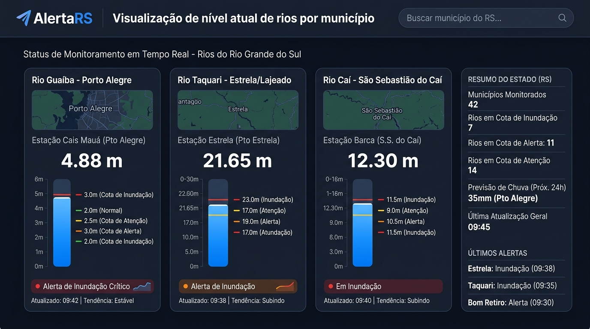
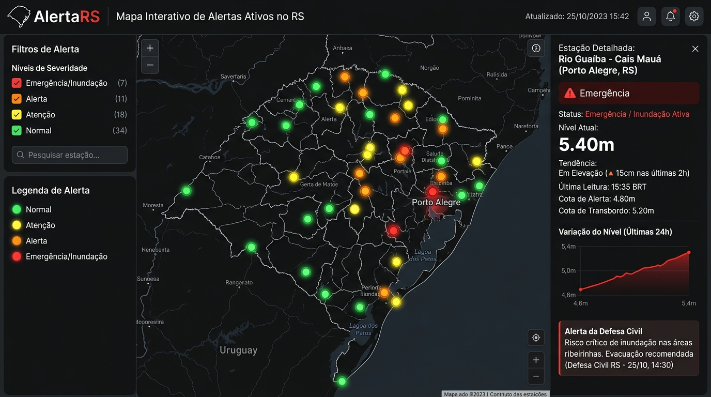

# Projeto Integrador IV - Etapa 1
**Universidade de Caxias do Sul (UCS)**  
**Curso de Bacharelado em Ciência da Computação / Análise e Desenvolvimento de Sistemas**

---

## 1. Identificação do Grupo e Responsabilidades no Scrum

- **Product Owner:** `[Integrante 1]`
- **Scrum Master:** `[Integrante 2]`
- **Desenvolvedor 1:** `[Integrante 3]`
- **Desenvolvedor 2:** `[Integrante 4]`
- **Desenvolvedor 3:** `[Integrante 5]`

---

## 2. Definição do Projeto e Fonte de Dados

- **Nome do Projeto:** AlertaRS – Painel de Monitoramento Hidrológico e Prevenção Climática
- **Objetivo do Projeto:** Desenvolver uma aplicação web voltada ao monitoramento em tempo real e análise histórica das condições hidrológicas e meteorológicas dos municípios e bacias hidrográficas do Rio Grande do Sul. O sistema processa dados de telemetria (níveis de rios e réguas linimétricas) e estações meteorológicas (volume de chuva acumulada), calculando automaticamente a proximidade em relação às cotas de atenção, alerta e inundação, além de prover dashboards comparativos e histórico de alertas da Defesa Civil para suporte à decisão comunitária e preventiva.
- **Fonte de Dados:** 
  - **Organização / Entidade:** Plataforma ClimaRS – Secretaria do Meio Ambiente e Infraestrutura (SEMA) / Defesa Civil do RS / PROCERGS.
  - **Local da Fonte (URL):** [https://clima.rs.gov.br](https://clima.rs.gov.br) (Carta de Serviços RS: [rs.gov.br/carta-de-servicos](https://www.rs.gov.br/carta-de-servicos/servicos?servico=3287)).

---

## 3. Artefato 1: Backlog do Produto (Product Backlog)

Abaixo encontra-se a lista de todas as 8 necessidades do usuário priorizadas e pontuadas em Story Points (estimativa por Planning Poker):

| # | Necessidade do Usuário / Funcionalidade | Pontuação (Story Points) | Status |
| :---: | :--- | :---: | :---: |
| **BP-01** | **Visualizar nível atual de rios e bacias por município** — O usuário seleciona um município e vê os níveis de rios em tempo real, com indicação visual das cotas (atenção, alerta, inundação). | **13 pts** | **Sprint 1** |
| **BP-02** | **Consultar histórico de chuva acumulada por estação meteorológica** — O usuário filtra por estação e período e visualiza o volume de precipitação acumulada em gráfico de séries temporais. | **8 pts** | **Sprint 1** |
| **BP-03** | **Visualizar mapa interativo de alertas ativos** — Exibe um mapa do RS com marcadores coloridos por nível de alerta (verde, amarelo, laranja, vermelho) para cada estação/município monitorado. | **13 pts** | **Sprint 1** |
| **BP-04** | **Consultar histórico de alertas emitidos pela Defesa Civil** — O usuário filtra por município e período e acessa os registros de eventos de alerta anteriores com data, tipo e nível. | **8 pts** | Backlog futuro |
| **BP-05** | **Comparar municípios por indicadores hidrológicos** — O usuário seleciona até 3 municípios e visualiza um painel comparativo com nível do rio, chuva acumulada e status de alerta lado a lado. | **8 pts** | Backlog futuro |
| **BP-06** | **Exibir dashboard com indicadores consolidados do estado** — Visão geral com totais de estações em alerta, municípios críticos, precipitação média e tendência das últimas 24h. | **5 pts** | Backlog futuro |
| **BP-07** | **Filtrar estações por bacia hidrográfica** — O usuário seleciona uma bacia e visualiza apenas as estações pertencentes a ela, com os dados de nível e chuva correspondentes. | **5 pts** | Backlog futuro |
| **BP-08** | **Exportar relatório de dados por município e período** — O usuário gera e baixa um arquivo com os dados de nível e precipitação de um município em um intervalo de datas selecionado. | **5 pts** | Backlog futuro |

*Total do Product Backlog: 68 Story Points.*

---

## 4. Artefato 2: Backlog da Sprint (Sprint Backlog - 1ª Entrega)

Para o primeiro ciclo de desenvolvimento (Sprint 1), foram priorizados **3 itens do Backlog do Produto**, totalizando uma estimativa de velocidade da equipe de **34 Story Points**.

- **Velocidade Estimada da Equipe:** 34 Story Points / sprint.

### Itens Selecionados para a Sprint 1:
1. **BP-01: Visualizar nível atual de rios e bacias por município (13 pts)** — Funcionalidade de manipulação de telemetria e calculador de cotas.
2. **BP-02: Consultar histórico de chuva acumulada por estação meteorológica (8 pts)** — Análise temporal pluviométrica.
3. **BP-03: Visualizar mapa interativo de alertas ativos (13 pts)** — Mapa cartográfico dinâmico com marcadores por severidade.

**Total da Sprint 1:** 34 Story Points.

---

## 5. Artefato 3: Detalhamento das Histórias, Protótipos e Tarefas da Equipe

### História 1: BP-01 — Visualizar nível atual de rios por município (13 pts)
- **Descrição da História:** *Como morador ou agente de Defesa Civil de um município gaúcho, quero consultar o nível atual dos rios e bacias da minha região para saber se há risco de inundação e tomar decisões preventivas com antecedência.*
- **Critérios de Aceitação:**
  - Exibição de campo de busca por município do RS.
  - Exibição de cards de estações fluviométricas com medidor de nível em metros.
  - Indicadores de estado visual: Cota de Atenção (amarelo), Cota de Alerta (laranja) e Cota de Inundação (vermelho).
- **Protótipo de Interface (História 1):**
  
- **Tarefas e Responsabilidades (Scrum):**
  - `T-01.1`: Integrar API ClimaRS para busca de dados de nível por município (*Responsável: `[Integrante 3 - Dev]`*).
  - `T-01.2`: Desenvolver componente de card de estação com medidor visual de cota (*Responsável: `[Integrante 4 - Dev]`*).
  - `T-01.3`: Implementar campo de busca e filtro por município com retorno dos dados (*Responsável: `[Integrante 5 - Dev]`*).
  - `T-01.4`: Validar se a exibição das cotas atende ao critério da Defesa Civil (*Responsável: `[Integrante 1 - PO]`*).
  - `T-01.5`: Coordenar revisão de progresso nas dailies e remover impedimentos (*Responsável: `[Integrante 2 - SM]`*).

---

### História 2: BP-02 — Consultar histórico de chuva acumulada (8 pts)
- **Descrição da História:** *Como técnico ambiental ou pesquisador, quero visualizar o histórico de precipitação acumulada por estação meteorológica em um período específico para analisar tendências pluviométricas e correlacionar com eventos de cheia.*
- **Critérios de Aceitação:**
  - Seletor de estação meteorológica e filtro de período (data início / data fim).
  - Gráfico de precipitação diária acumulada (mm) em séries temporais.
  - Exibição do total acumulado e indicador de médias históricas.
- **Protótipo de Interface (História 2):**
  
- **Tarefas e Responsabilidades (Scrum):**
  - `T-02.1`: Consultar e tratar dados históricos de precipitação da API ClimaRS (*Responsável: `[Integrante 3 - Dev]`*).
  - `T-02.2`: Desenvolver gráfico de séries temporais (precipitação × data) (*Responsável: `[Integrante 4 - Dev]`*).
  - `T-02.3`: Implementar seletor de estação e filtro de período (data início / data fim) (*Responsável: `[Integrante 5 - Dev]`*).
  - `T-02.4`: Validar se os dados exibidos correspondem ao período e estação selecionados (*Responsável: `[Integrante 1 - PO]`*).
  - `T-02.5`: Monitorar prazo de entrega e garantir integração entre frontend e dados (*Responsável: `[Integrante 2 - SM]`*).

---

### História 3: BP-03 — Visualizar mapa interativo de alertas ativos (13 pts)
- **Descrição da História:** *Como cidadão ou gestor municipal, quero visualizar em um mapa do Rio Grande do Sul os alertas hidrológicos ativos por região, com codificação por cor de severidade, para identificar rapidamente as áreas em situação crítica.*
- **Critérios de Aceitação:**
  - Mapa interativo do RS com marcadores coloridos por severidade (Verde = Normal, Amarelo = Atenção, Laranja = Alerta, Vermelho = Emergência).
  - Painel lateral de legenda e suporte a filtros de severidade.
  - Slide-over / modal de detalhamento da estação ao clicar no marcador.
- **Protótipo de Interface (História 3):**
  
- **Tarefas e Responsabilidades (Scrum):**
  - `T-03.1`: Integrar biblioteca de mapa (ex.: Leaflet.js) com dados de localização das estações (*Responsável: `[Integrante 3 - Dev]`*).
  - `T-03.2`: Implementar marcadores dinâmicos com cor conforme status de alerta da estação (*Responsável: `[Integrante 4 - Dev]`*).
  - `T-03.3`: Desenvolver painel lateral de detalhe ao selecionar uma estação no mapa (*Responsável: `[Integrante 5 - Dev]`*).
  - `T-03.4`: Validar legenda e critérios de classificação de severidade com referência da Defesa Civil (*Responsável: `[Integrante 1 - PO]`*).
  - `T-03.5`: Facilitar alinhamento entre desenvolvedores e revisar consistência dos dados no mapa (*Responsável: `[Integrante 2 - SM]`*).
