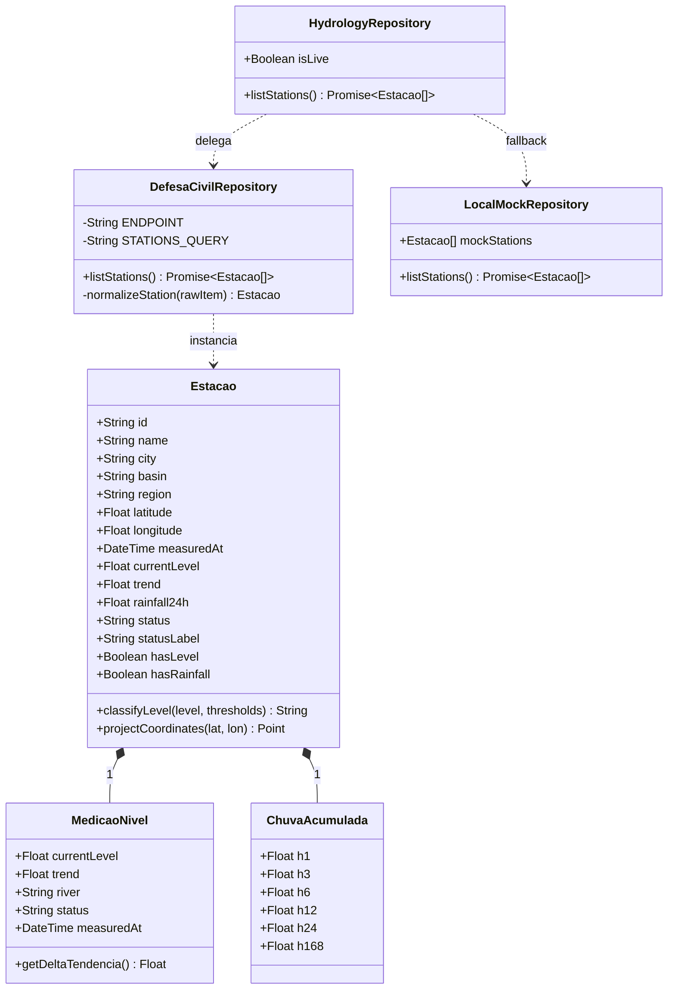
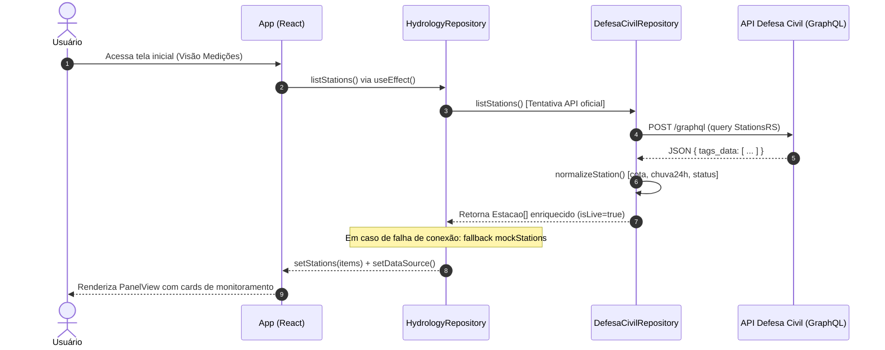
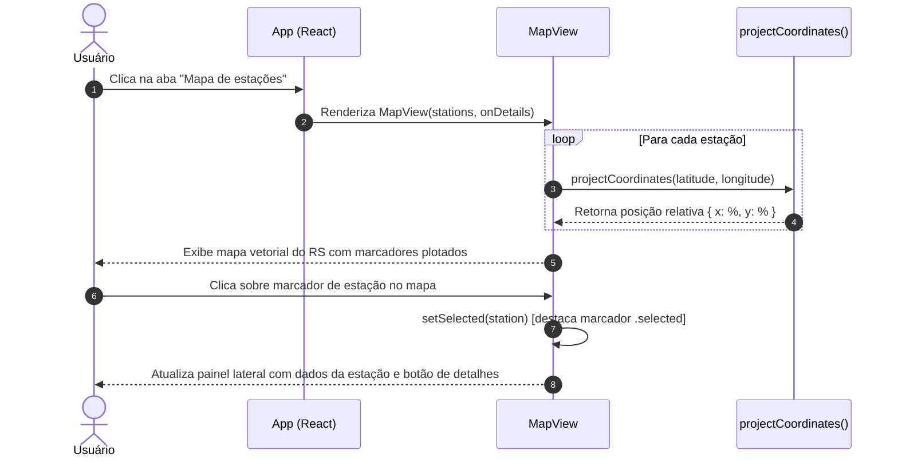
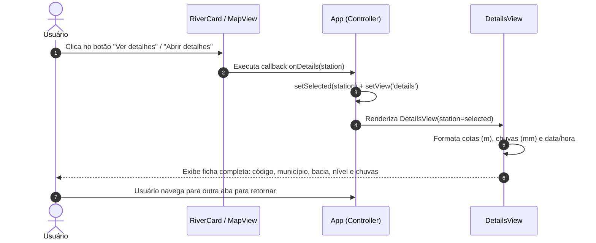

# Projeto Integrador IV-A — Etapa 2 (Consolidação Final)

**Universidade de Caxias do Sul (UCS)**  
**Curso:** Análise e Desenvolvimento de Sistemas (EAD)  
**Trimestre:** 2026/3  
**Professor:** Rocco (`gerocco@ucs.br`)  

---

## 1. Identificação do Grupo

- **Product Owner:** João Pedro Castro de Brito
- **Scrum Master:** Neytan Belisário
- **Desenvolvedores:**
  - Arthur Schmidt
  - Gabriel Antoniazzi
  - Sandro Roni Soares

---

## 2. Proposta de Projeto e Fonte de Dados

- **Projeto:** AlertaRS — Painel de Monitoramento Hidrológico.
- **Objetivo:** Apresentar, em uma aplicação web moderna e responsiva, medições telemétricas atuais de estações hidrometeorológicas do Rio Grande do Sul, sua localização geográfica no mapa vetorial do estado e a ficha detalhada de medições de uma estação selecionada, auxiliando na prevenção e no acompanhamento de cheias e eventos climáticos extremos.
- **Fonte Oficial de Dados:** [API de Dados Hidrometeorológicos da Defesa Civil RS](https://sistemas.defesacivil.rs.gov.br/api-redehidrometeorologica) (`https://redehidrometeorologica.defesacivil.rs.gov.br/graphql`).
- **Base Cartográfica:** [API de Malhas Geográficas do IBGE](https://servicodados.ibge.gov.br/api/v3/malhas/estados/43).
- **Desenvolvimento e Arquitetura:** As funcionalidades desenvolvidas consomem dados oficiais por meio de requisições GraphQL com adaptação e normalização de entidades em memória. O sistema adota um mecanismo de resiliência com *fallback* gracioso para dados simulados em caso de instabilidade externa ou restrição de CORS no cliente. O projeto não requer banco de dados próprio, priorizando telemetria pública oficial em tempo real.

---

## 3. Backlog do Produto

O Backlog do Produto compreende as cinco necessidades essenciais identificadas para a plataforma, estimadas por Planning Poker pela equipe:

1. **Painel de medições atuais** — 13 pontos.
2. **Mapa de estações do Rio Grande do Sul** — 13 pontos.
3. **Detalhes da estação** — 8 pontos.
4. **Histórico de chuvas** — 8 pontos. *(identificada para evoluções futuras)*
5. **Filtro de estações** — 5 pontos. *(identificada para evoluções futuras)*

**Total do Backlog do Produto: 47 pontos.**

---

## 4. Backlog da Sprint

A Sprint concentrou o desenvolvimento das três necessidades prioritárias e fundamentais para a entrega de valor funcional aos usuários:

1. **Painel de medições atuais** — 13 pontos.
2. **Mapa de estações do Rio Grande do Sul** — 13 pontos.
3. **Detalhes da estação** — 8 pontos.

**Total da Sprint: 34 pontos.**

---

## 5. Histórias do Backlog da Sprint, Tarefas e Responsabilidades

### História 1 — Painel de medições atuais
- **Declaração:** Eu, como usuário do AlertaRS, gostaria de visualizar as medições atuais das estações, para acompanhar o nível dos rios e a chuva acumulada.
- **Backlog da Sprint:** Painel de medições atuais (13 pontos).
- **Descrição:** O usuário acessa a aplicação e obtém uma visão em cards das estações monitoradas pelo estado, visualizando para cada ponto o nível atual do rio, a precipitação acumulada nas últimas 24 horas, o município, a bacia hidrográfica e o horário da última medição, com indicação visual da fonte oficial conectada.
- **Tarefas e Responsáveis:**
  - **Arthur Schmidt (Desenvolvedor):** Implementar a consulta GraphQL à API da Defesa Civil RS e a camada de normalização e fallback dos dados hidrometeorológicos.
  - **Gabriel Antoniazzi (Desenvolvedor):** Desenvolver a interface visual em grid e os cards de medição (`river-card`), com destaque para as cotas e indicador de status.
- **Protótipo de Interface:** Referência `bp01_nivel_rios.jpg` / card de monitoramento hidrometeorológico.

---

### História 2 — Mapa de estações
- **Declaração:** Eu, como usuário do AlertaRS, gostaria de visualizar as estações em um mapa do Rio Grande do Sul, para localizar os pontos de monitoramento.
- **Backlog da Sprint:** Mapa de estações (13 pontos).
- **Descrição:** O usuário visualiza o mapa geográfico vetorial do Rio Grande do Sul com marcadores interativos posicionados pelas coordenadas geográficas de latitude e longitude de cada estação. Ao selecionar um marcador, o painel lateral exibe instantaneamente o resumo daquela estação.
- **Tarefas e Responsáveis:**
  - **Gabriel Antoniazzi (Desenvolvedor):** Desenvolver a renderização da malha SVG do RS e a função matemática de projeção das coordenadas de latitude e longitude dos pontos telemétricos.
  - **Sandro Roni Soares (Desenvolvedor):** Implementar o evento de seleção interativa nos marcadores e a sincronização em tempo real com o painel lateral.
- **Protótipo de Interface:** Referência `bp03_mapa_alertas.jpg` / mapa vetorial com marcadores e painel lateral.

---

### História 3 — Detalhes da estação
- **Declaração:** Eu, como usuário do AlertaRS, gostaria de abrir os detalhes de uma estação, para consultar suas medições e sua identificação.
- **Backlog da Sprint:** Detalhes da estação (8 pontos).
- **Descrição:** Ao selecionar "Ver detalhes" no card ou no painel do mapa, o usuário é direcionado para a ficha detalhada da estação, visualizando: código identificador oficial, município, bacia hidrográfica, região geográfica, cota atual do rio com tendência, precipitações acumuladas em janelas temporais de 1h, 3h, 6h, 12h e 24h, situação do alerta e timestamp da telemetria.
- **Tarefas e Responsáveis:**
  - **Arthur Schmidt (Desenvolvedor):** Mapear as propriedades detalhadas da estação e formatadores numéricos (m, mm) e temporais (data/hora pt-BR).
  - **Sandro Roni Soares (Desenvolvedor):** Desenvolver o componente de visualização de detalhes (`DetailsView`) e conectá-lo à rota/estado de seleção da aplicação.
- **Protótipo de Interface:** Painel consolidado de especificações técnicas da estação.

---

## 6. Especificação das Histórias (Modelagem de Software)

### 6.1. Modelo Estrutural (Diagrama de Classes UML Unificado da Sprint)

O modelo estrutural especifica as classes de domínio, value objects, serviços e adaptadores de rede responsáveis pela manipulação e exibição dos dados no software:



*Artefatos gráficos gerados:*
- Vetorial SVG: `docs/diagramas/modelo-estrutural-classes.svg`
- Imagem PNG: `docs/diagramas/modelo-estrutural-classes.png`

---

### 6.2. Modelos Comportamentais

#### História 1 — Painel de medições atuais (Diagrama de Sequência)
Especifica a inicialização da tela inicial, a busca remota na API GraphQL da Defesa Civil RS, o tratamento de resiliência e a montagem dinâmica dos cards.



*Artefatos gráficos gerados:* `docs/diagramas/sequencia-historia-1-painel.svg` e `.png`.

---

#### História 2 — Mapa de estações (Diagrama de Sequência)
Especifica a projeção matemática das coordenadas no viewBox do SVG do RS e o fluxo de seleção interativa do usuário.



*Artefatos gráficos gerados:* `docs/diagramas/sequencia-historia-2-mapa.svg` e `.png`.

---

#### História 3 — Detalhes da estação (Diagrama de Sequência)
Especifica a transição de estado após o clique no botão de ação, a extração dos dados pluviométricos e hidrológicos e a exibição da ficha técnica.



*Artefatos gráficos gerados:* `docs/diagramas/sequencia-historia-3-detalhes.svg` e `.png`.

---

## 7. Demonstração do Software

- **Vídeo de Demonstração da Versão do Software:** `(LINK DO YOUTUBE)`  
  *(A ser disponibilizado pela equipe no YouTube via conta institucional `@ucs.br`, conforme roteiro estruturado)*
- **Roteiro Completo de Apresentação:** Disponível em [`docs/roteiro-gravacao-video.md`](docs/roteiro-gravacao-video.md), contendo falas sugeridas para os papéis de Product Owner, Scrum Master e Desenvolvedores, roteiro de navegação nas 3 telas e esclarecimentos técnicos sobre arquitetura e dados oficiais.
- **Execução Local:**
  ```bash
  cd app
  npm install
  npm test        # Executa a suite de testes unitários do domínio
  npm run lint    # Validação de qualidade de código ESLint
  npm run dev     # Inicia o servidor de desenvolvimento na porta 5173
  ```
