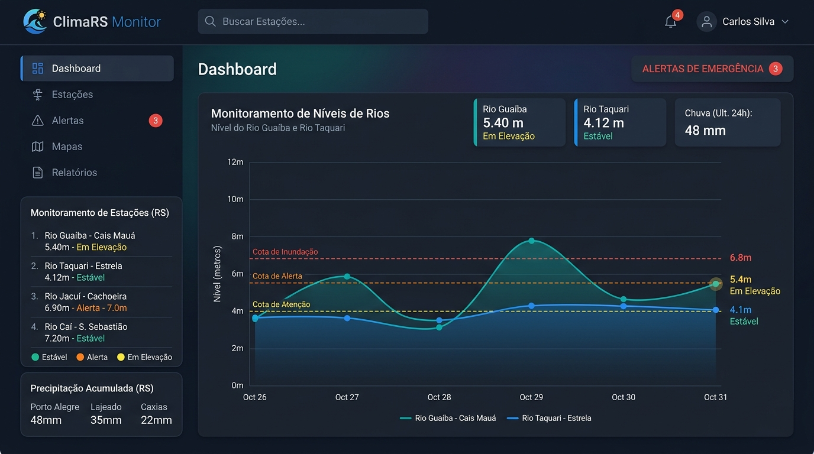
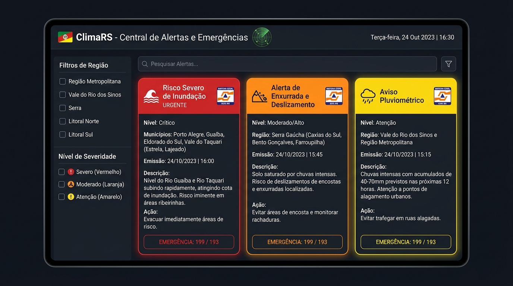
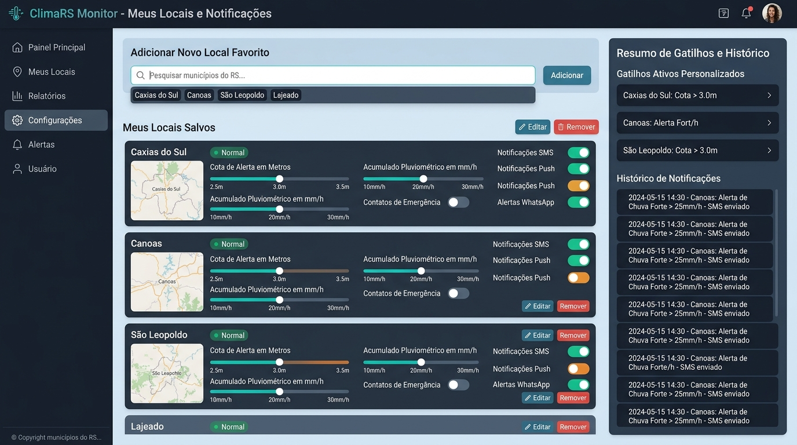

# ClimaRS Monitor

**Sistema de Monitoramento Hidrometeorológico e Alertas de Risco do Rio Grande do Sul**

> **Projeto Integrador IV** — Universidade de Caxias do Sul (UCS)  
> Bacharelado em Ciência da Computação / Análise e Desenvolvimento de Sistemas

---

## 📌 Visão Geral

O **ClimaRS Monitor** é um aplicativo web voltado ao acompanhamento em tempo real dos níveis fluviométricos (rios), cotas de emergência (atenção, alerta e inundação), acumulados pluviais (chuvas) e boletins de risco no Estado do Rio Grande do Sul.

A solução foi projetada para processar dados abertos governamentais, transformando dados brutos de estações de monitoramento em informações visuais e alertas preventivos para a população e gestores públicos.

---

## 📡 Fonte de Dados

Os dados utilizados pelo aplicativo são obtidos de fontes públicas do Governo do Estado do RS:

- **Entidades:** PROCERGS, SEMA (Secretaria do Meio Ambiente e Infraestrutura) e Defesa Civil do RS.
- **Plataforma Original:** [ClimaRS](https://climars.rs.gov.br)
- **Dados Ingeridos:**
  - Níveis fluviométricos contínuos em metros e cotas limiares de segurança.
  - Acumulados pluviométricos (mm) por períodos de 24h, 48h e 72h.
  - Boletins e avisos de risco de enxurrada, inundação e deslizamento.

---

## 📋 Artefatos do Scrum (Etapa 1)

### Estrutura da Equipe
- **Product Owner:** `[Nome do Integrante 1]`
- **Scrum Master:** `[Nome do Integrante 2]`
- **Desenvolvedores:** `[Nome do Integrante 3]`, `[Nome do Integrante 4]`, `[Nome do Integrante 5]`, `[Nome do Integrante 6]`, `[Nome do Integrante 7]`

---

### Product Backlog

| ID | Funcionalidade | Esforço (Story Points) | Descrição |
| :---: | :--- | :---: | :--- |
| **US-01** | Painel Hidrológico Interativo | **13 pts** | Gráficos temporais de nível dos rios vs. cotas de inundação |
| **US-02** | Mapa Pluviométrico e Acumulado de Chuva | **8 pts** | Visualização de precipitação acumulada por bacia/município |
| **US-03** | Central de Alertas da Defesa Civil | **5 pts** | Feed de avisos de risco filtráveis por severidade e região |
| **US-04** | Relatórios Históricos e Comparativos | **8 pts** | Comparação de dados pluviais entre anos anteriores |
| **US-05** | Gestão de Locais Favoritos e Limiares | **3 pts** | Configuração de municípios salvos e gatilhos de aviso |

> [!NOTE]
> O Backlog do Produto contempla apenas funcionalidades com valor de negócio direto para o usuário final, excluindo rotinas internas ou cadastros de autenticação.

---

### Sprint Backlog (Versão 1)

**Velocidade Estimada da Sprint:** 21 Story Points

1. **US-01: Painel Hidrológico Interativo (13 pts)** — Processamento e exibição de níveis vs. cotas de inundação.
2. **US-03: Central de Alertas da Defesa Civil (5 pts)** — Feed de emergências regionalizado.
3. **US-05: Gestão de Locais Favoritos (3 pts)** — Personalização de municípios e limiares de notificação.

---

## 🖼️ Protótipos de Interface

### 1. Painel Hidrológico Interativo (US-01)
Gráficos de níveis fluviométricos em tempo real com linhas horizontais de Cota de Atenção (amarelo), Alerta (laranja) e Inundação (vermelho).



---

### 2. Central de Alertas e Emergências (US-03)
Cartões coloridos por grau de severidade (Inundação, Enxurrada/Deslizamento, Pluviométrico) e canal de emergência.



---

### 3. Configuração de Locais Favoritos (US-05)
Interface para cadastro de municípios de interesse e ajuste de sliders para gatilhos de notificação.



---

## 📂 Estrutura de Arquivos

```text
.
├── README.md                          # Documentação técnica do projeto
├── Etapa_1_Projeto_Integrador.md      # Relatório completo para entrega acadêmica (PDF)
├── Orientações para o Projeto.pdf     # Requisitos e critérios de avaliação do PI IV (UCS)
└── prototipos/                        # Imagens dos protótipos visuais de interface
    ├── prototipo_1_painel_hidrologico.jpg
    ├── prototipo_2_central_alertas.jpg
    └── prototipo_3_favoritos_config.jpg
```