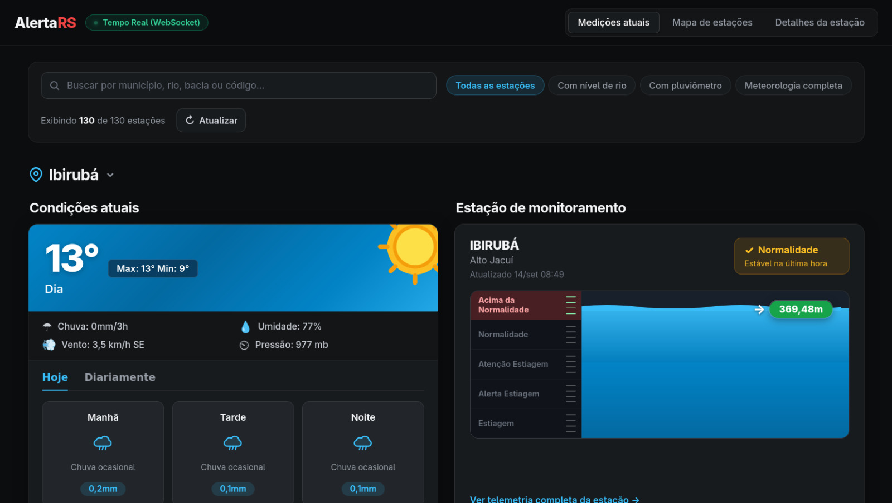
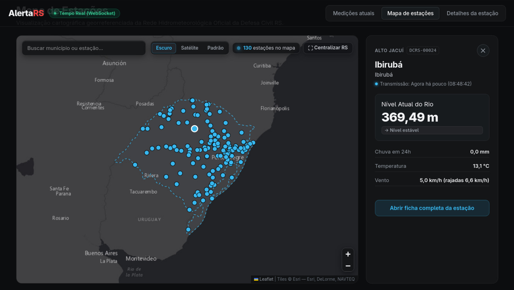
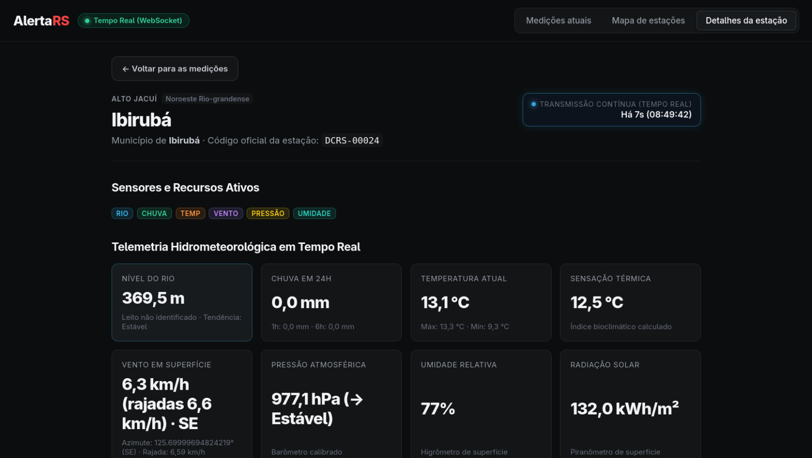

# AlertaRS

> Painel web de monitoramento hidrometeorológico em tempo real do Rio Grande do Sul.

[](https://react.dev/)
[](https://vitejs.dev/)
[](https://leafletjs.com/)
[](https://nodejs.org/api/test.html)
[]()

> [!NOTE]
> Projeto desenvolvido para a disciplina de **Projeto Integrador IV-A** do curso de **Análise e Desenvolvimento de Sistemas (ADS)** da **Universidade de Caxias do Sul (UCS)**. O objetivo é integrar práticas ágeis com Scrum e manipulação de bases de dados públicas oficiais para apoio à prevenção de eventos climáticos no RS.

---

## Telas do Aplicativo

| Painel Principal e Métricas | Mapa de Estações |
| :---: | :---: |
|  |  |
| *Visão consolidada com indicadores rápidos e cartões de estações* | *Distribuição geográfica das estações com indicadores de alerta* |

| Detalhes da Estação |
| :---: |
|  |
| *Telemetria detalhada: cotas dos rios, chuva acumulada (1h a 24h) e meteorologia completa* |

---

## Funcionalidades Principais

- **Painel de Medições em Tempo Real:** Acompanhamento instantâneo do nível de rios (com categorização visual por normalidade, atenção, alerta e inundação) e chuva acumulada em 24h.
- **Mapa Geográfico Interativo:** Plotagem georreferenciada de estações sobre a malha do Rio Grande do Sul via Leaflet, com seleção de estação e inspeção direta.
- **Ficha Técnica e Telemetria Completa:** Visualização de acumulados pluviométricos (1h, 3h, 6h, 12h, 24h), velocidade e direção do vento (rosa dos ventos), radiação solar, temperatura, pressão e umidade relativa.
- **Busca e Filtros Multicritério:** Pesquisa instantânea por nome do município, rio, bacia hidrográfica ou código da estação, além de filtros por sensores disponíveis.
- **Camada Resiliente de Dados:** Integração primária via GraphQL e WebSocket com a Defesa Civil RS e mecanismo automático de contingência (*fallback* para dados simulados em caso de indisponibilidade externa).

---

## Arquitetura e Fontes de Dados

```
                 ┌─────────────────────────────────────────┐
                 │          AlertaRS Web (React 19)        │
                 └───────────────────┬─────────────────────┘
                                     │
                     ┌───────────────┴───────────────┐
                     ▼                               ▼
     ┌───────────────────────────────┐  ┌─────────────────────────┐
     │  hydrologyRepository          │  │     Leaflet & IBGE      │
     │  (Camada de Dados & Domínio)  │  │  (Cartografia do RS)    │
     └───────────────┬───────────────┘  └─────────────────────────┘
                     │
         ┌───────────┴───────────┐
         ▼                       ▼
┌─────────────────┐     ┌──────────────────┐
│ Defesa Civil RS │     │  Mock Fallback   │
│ GraphQL & WSS   │     │ (Contingência)   │
└─────────────────┘     └──────────────────┘
```

- **Defesa Civil do Rio Grande do Sul:** Consulta telemétrica via endpoint GraphQL oficial (`redehidrometeorologica.defesacivil.rs.gov.br`) e stream de eventos em tempo real via WebSocket.
- **Instituto Brasileiro de Geografia e Estatística (IBGE):** Base cartográfica para a delimitação municipal e georreferenciamento estadual.
- **Arquitetura Desacoplada:** O consumo de dados é centralizado em repositórios tipados com validação de limites sentinela (sensores em implantação) e normalização de entidades em memória.

> [!TIP]
> Em ambientes de produção (como Vercel), requisições para a Defesa Civil utilizam proxy reverso interno configurado em `vercel.json` para evitar bloqueios de CORS.

---

## Metodologia Ágil (Scrum)

O desenvolvimento seguiu o framework Scrum, cobrindo as histórias prioritárias do Backlog da Sprint com estimativas em Story Points:

| História | Funcionalidade | Esforço | Status |
| :---: | :--- | :---: | :---: |
| **História 1** | Painel de medições atuais com cotas e chuvas | **13 pts** | Concluído |
| **História 2** | Mapa de estações georreferenciado do Rio Grande do Sul | **13 pts** | Concluído |
| **História 3** | Detalhes e especificações técnicas da estação | **8 pts** | Concluído |

### Equipe do Projeto

| Integrante | Papel no Scrum |
| :--- | :--- |
| **João Pedro Castro de Brito** | Product Owner |
| **Neytan Belisário** | Scrum Master |
| **Arthur Schmidt** | Desenvolvedor |
| **Gabriel Antoniazzi** | Desenvolvedor |
| **Sandro Roni Soares** | Desenvolvedor |

Documentação acadêmica detalhada e diagramas estruturais UML disponíveis em:
- [Etapa-1.md](Etapa-1.md) — Concepção, Backlogs e Protótipos Conceituais
- [Etapa-2.md](Etapa-2.md) — Consolidação Final, Diagramas de Classes e Sequência
- [docs/arquitetura-e-dados.md](docs/arquitetura-e-dados.md) — Mapeamento técnico e estratégias de resiliência

---

## Como Executar

### Pré-requisitos

- [Node.js](https://nodejs.org/) versão 20 ou superior
- Gerenciador de pacotes `npm`

### Instalação e Inicialização

1. Clone o repositório e acesse a pasta da aplicação:
   ```bash
   git clone https://github.com/Bakurin0/app-projeto.git
   cd app-projeto/app
   ```

2. Instale as dependências:
   ```bash
   npm install
   ```

3. Inicie o servidor de desenvolvimento:
   ```bash
   npm run dev
   ```

   A aplicação estará disponível em `http://localhost:5173`.

### Testes e Validações

O projeto conta com validações automatizadas via Node Test Runner nativo e ESLint:

```bash
# Executa a suite de testes unitários de domínio
npm test

# Executa a verificação estática de código
npm run lint

# Gera o build de produção otimizado
npm run build
```

---

## Estrutura do Repositório

```text
.
├── app/                           # Aplicação web React + Vite
│   ├── src/
│   │   ├── components/            # Componentes visuais (Map, Overview, Modal)
│   │   ├── domain/                # Regras de negócio, formatações e cálculos
│   │   ├── services/              # Integração GraphQL, WebSocket e repositórios
│   │   └── data/                  # Dados cartográficos e mock de contingência
│   └── test/                      # Testes automatizados unitários
├── docs/                          # Documentação e especificações
│   ├── diagramas/                 # Diagramas de classes e sequência UML
│   └── telas/                     # Capturas de tela da versão funcional
├── Etapa-1.md                     # Documento da entrega 1
├── Etapa-2.md                     # Documento da entrega 2
└── vercel.json                    # Configuração de deploy e proxy de CORS
```
