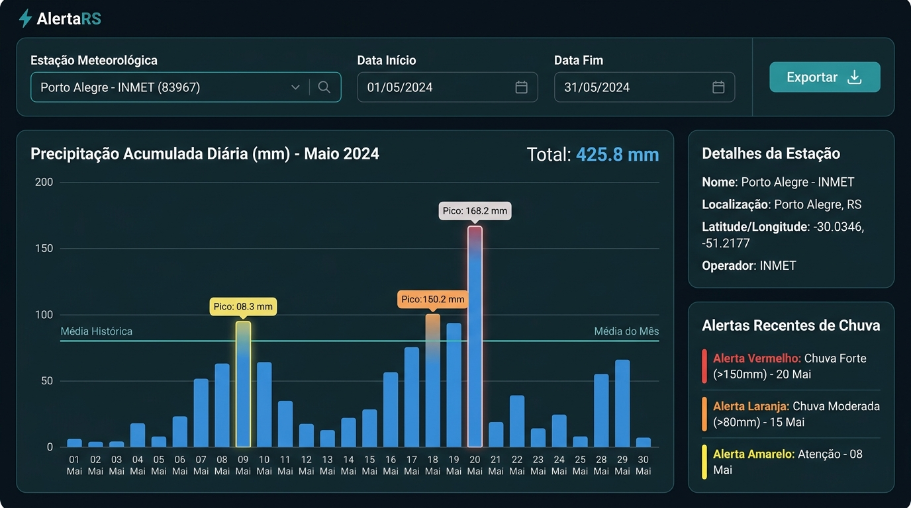

# AlertaRS

**Painel de Monitoramento Hidrológico e Prevenção Climática do Rio Grande do Sul**

> **Projeto Integrador IV** — Universidade de Caxias do Sul (UCS)  
> Curso de Análise e Desenvolvimento de Sistemas / Ciência da Computação

---

## 📌 Sobre o Projeto

O **AlertaRS** é uma aplicação web voltada ao monitoramento em tempo real e análise histórica das condições hidrológicas e meteorológicas dos municípios e bacias hidrográficas do Estado do Rio Grande do Sul. 

O sistema processa dados contínuos de telemetria fluviométrica (níveis dos rios e réguas linimétricas) e pluviométrica (chuva acumulada em mm), calculando a proximidade em relação às cotas de segurança (atenção, alerta e inundação) e exibindo mapas interativos e boletins da Defesa Civil.

---

## 📡 Fonte de Dados Pública

- **Entidade Responsável:** Plataforma ClimaRS – Secretaria do Meio Ambiente e Infraestrutura (SEMA) / Defesa Civil do RS / PROCERGS.
- **Endereço do Portal:** [https://clima.rs.gov.br](https://clima.rs.gov.br)
- **Carta de Serviços RS:** [rs.gov.br/carta-de-servicos](https://www.rs.gov.br/carta-de-servicos/servicos?servico=3287)

---

## 👥 Equipe e Estrutura Scrum

| Integrante | Papel no Scrum | Responsabilidades |
| :--- | :--- | :--- |
| `[Integrante 1]` | **Product Owner** | Visão do produto, gestão do Backlog do Produto e validação das cotas |
| `[Integrante 2]` | **Scrum Master** | Facilitação do processo Scrum, dailies e remoção de impedimentos |
| `[Integrante 3]` | **Desenvolvedor** | Integração das APIs ClimaRS (níveis, precipitação e mapas) |
| `[Integrante 4]` | **Desenvolvedor** | Engenharia dos componentes de cards, medidores e gráficos de séries temporais |
| `[Integrante 5]` | **Desenvolvedor** | Desenvolvimento dos filtros de busca, seletores e painel lateral de detalhes |

---

## 📊 Artefatos do Scrum (Etapa 1)

### Product Backlog (8 Necessidades Priorizadas)

| # | Funcionalidade | Pontos | Escopo |
| :---: | :--- | :---: | :---: |
| **BP-01** | **Visualizar nível atual de rios e bacias por município** | **13** | **Sprint 1** |
| **BP-02** | **Consultar histórico de chuva acumulada por estação meteorológica** | **8** | **Sprint 1** |
| **BP-03** | **Visualizar mapa interativo de alertas ativos** | **13** | **Sprint 1** |
| **BP-04** | Consultar histórico de alertas emitidos pela Defesa Civil | 8 | Backlog |
| **BP-05** | Comparar municípios por indicadores hidrológicos | 8 | Backlog |
| **BP-06** | Exibir dashboard com indicadores consolidados do estado | 5 | Backlog |
| **BP-07** | Filtrar estações por bacia hidrográfica | 5 | Backlog |
| **BP-08** | Exportar relatório de dados por município e período | 5 | Backlog |

*Total do Product Backlog: 68 Story Points.*

---

### Sprint Backlog (Sprint 1)

- **Velocidade Estimada da Equipe:** **34 Story Points / sprint**
- **Itens Priorizados:** `BP-01` (13 pts) + `BP-02` (8 pts) + `BP-03` (13 pts) = **34 pts**

---

## 🎨 Protótipos de Interface (Sprint 1)

### BP-01: Visualizar Nível Atual de Rios por Município (13 pts)
*Pesquisa por município, cards de estações com medidores visuais de nível e cotas limiares.*


---

### BP-02: Consultar Histórico de Chuva Acumulada (8 pts)
*Seletor de estação meteorológica, intervalo de datas e gráfico de precipitação acumulada.*



---

### BP-03: Visualizar Mapa Interativo de Alertas Ativos (13 pts)
*Mapa interativo do RS com marcadores por cor de severidade e painel de detalhamento da estação.*


---

## 📁 Estrutura do Repositório

```text
.
├── README.md                          # Documentação e apresentação do projeto AlertaRS
├── Etapa_1_Projeto_Integrador.md      # Relatório completo para entrega acadêmica (PDF)
├── alerta_rs_backlog_e_historias.html # Template visual HTML dos artefatos do projeto
├── Orientações para o Projeto.pdf     # Diretrizes e edital do PI IV (UCS)
└── prototipos/                        # Imagens dos protótipos visuais de interface
    ├── bp01_nivel_rios.jpg
    ├── bp02_historico_chuva.jpg
    └── bp03_mapa_alertas.jpg
```